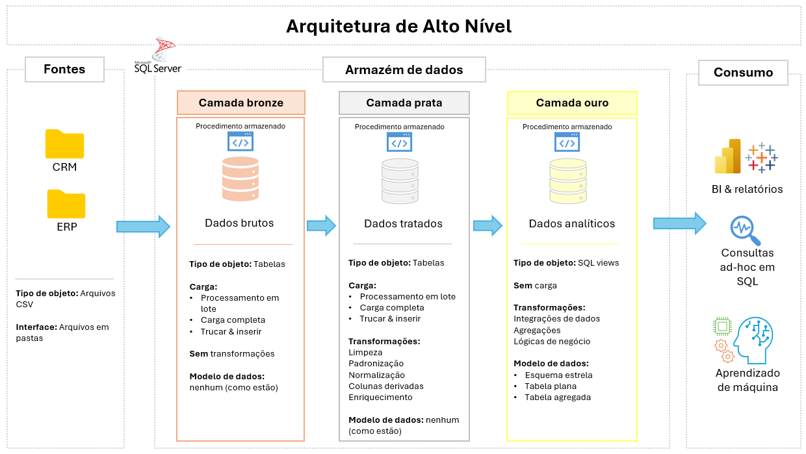

# 🏢 Projeto de Armazém de Dados e Análise de Negócios

Este projeto demonstra uma solução completa de armazém de dados e análise de negócios — da ingestão de dados à geração de insights acionáveis — com base em práticas adotadas no setor de engenharia e análise de dados.

---

## 🏗️ Arquitetura de Dados

A arquitetura de dados segue o modelo **medalhão** com três camadas distintas.  

1. **Camada bronze**: dados brutos obtidos de arquivos CSV (ERP e CRM), carregados em uma instância SQL Server sem modificações.
2. **Camada prata**: dados limpos, padronizados e normalizados, prontos para transformação analítica.
3. **Camada ouro**: dados modelados em esquema estrela, otimizados para análises e geração de relatórios.

---

## 📌 Visão Geral do Projeto

Este projeto envolve:

1. **Arquitetura de dados**: implementação do modelo medalhão em camadas (bronze, prata, ouro).
2. **Pipelines ETL**: extração, transformação e carga de dados CSV para o armazém.
3. **Modelagem de dados**: construção de esquema estrela com tabelas de fatos e dimensões.
4. **Análise e relatórios**: criação de consultas SQL e dashboards para insights estratégicos.

---

## 🚀 Requisitos do Projeto

### Construção do Armazém de Dados (Engenharia de Dados)

**Objetivo:** Desenvolver um armazém de dados utilizando SQL Server para consolidar dados de vendas e possibilitar análises confiáveis.

**Especificações:**
- **Fontes de dados:** arquivos CSV extraídos de sistemas ERP e CRM.
- **Qualidade dos dados:** etapas de limpeza e verificação de consistência.
- **Integração:** unificação das fontes em um modelo analítico coeso.
- **Escopo:** foco nos dados mais recentes, sem necessidade de histórico.
- **Documentação:** estruturação clara do modelo para uso por stakeholders e equipes analíticas.

---

## 📊 Análise e Relatórios (Análise de Dados)

**Objetivo:**  
Desenvolver análises baseadas em SQL para identificar padrões de comportamento do cliente, desempenho de produtos e tendências de vendas.  
Os dashboards produzidos oferecem suporte à tomada de decisões estratégicas orientadas por dados.

---

### 📎 Créditos

Este projeto foi inspirado no projeto "SQL Data Warehouse" criado por **Baraa Khatib Salkini**.  
Conteúdo original disponível em:  
🔗 [https://www.datawithbaraa.com](https://www.datawithbaraa.com)  
Licenciado sob a Licença MIT.
