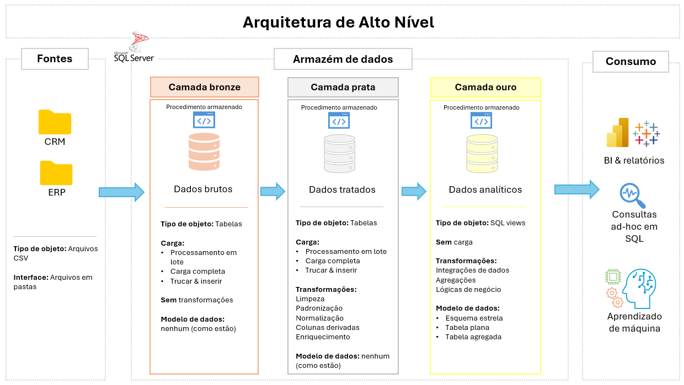
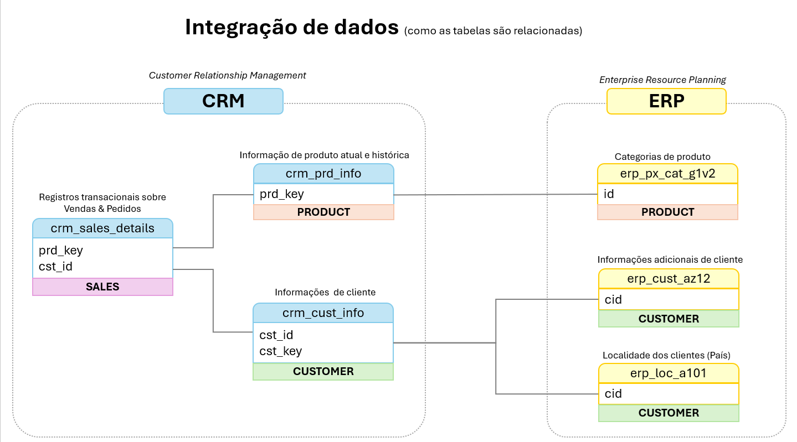

# 🏢 Projeto de Armazém de Dados e Análise de Negócios

Este projeto demonstra uma solução completa de **armazém de dados e análise de negócios** — da ingestão de dados à geração de insights acionáveis — com base em práticas adotadas no setor de engenharia e análise de dados.

---

## 🏗️ Arquitetura de Dados

A arquitetura segue o modelo **medalhão** com três camadas:

1. **Camada Bronze** → dados brutos obtidos de arquivos CSV (ERP e CRM), carregados sem modificações.  
2. **Camada Silver** → dados limpos, padronizados e normalizados.  
3. **Camada Gold** → dados modelados em esquema estrela (fatos e dimensões), prontos para análise.

---

## 📂 Estrutura do Repositório

- **dados/**
  - `source_crm/` e `source_erp/` → arquivos CSV brutos de entrada.
- **documentos/**
  - `arquitetura.png` → visão de alto nível da arquitetura.  
  - `integracao_dados.png` → diagrama de integração entre tabelas.  
  - `catalogo_bronze.md`, `catalogo_silver.md`, `catalogo_gold.md` → dicionários de dados das camadas.  
  - `matriz_qualidade_silver.md` → verificações de qualidade da Silver.  
  - `convencoes_nomenclatura.md` → padrão de nomes utilizado.  
- **scripts/**
  - `bronze/`, `silver/` → scripts DDL e ETL para criação/carregamento.  
  - `init_database.sql` → inicialização do banco.  
- **testes/**
  - `verificacao_qualidade_silver.sql` → checks de consistência (Silver).  
  - `verificacao_qualidade_gold.sql` → checks de integridade (Gold).  
- **README.md** → este arquivo.

---

## 📖 Documentação

- [Catálogo Bronze](documentos/catalogo_bronze.md)  
- [Catálogo Silver](documentos/catalogo_silver.md)  
- [Catálogo Gold](documentos/catalogo_gold.md)  
- [Matriz de Qualidade (Silver)](documentos/matriz_qualidade_silver.md)  
- [Convenções de Nomenclatura](documentos/convencoes_nomenclatura.md)  

---

## 🔗 Integração de Dados

O diagrama abaixo mostra como as tabelas se relacionam:  

---

## ⚡ Como Executar

1. Criar um banco de dados no **SQL Server**.  
2. Executar [`scripts/init_database.sql`](scripts/init_database.sql).  
3. Carregar os dados brutos da pasta `dados/` nas tabelas Bronze.  
4. Executar os scripts em `scripts/silver/` para gerar a camada Silver.  
5. Executar os scripts da camada Gold para criar as **views**.  
6. Validar os dados rodando os testes em `testes/`.  

---

## 📊 Análise e Relatórios

Com os dados da camada Gold (esquema estrela), é possível:  
- Analisar **padrões de clientes**.  
- Avaliar o **desempenho de produtos**.  
- Explorar **tendências de vendas**.  

---

## 📎 Créditos

Este projeto foi inspirado no projeto *SQL Data Warehouse* criado por **Baraa Khatib Salkini**.  
Conteúdo original disponível em:  
🔗 [https://www.datawithbaraa.com](https://www.datawithbaraa.com)  
Licenciado sob a **Licença MIT**.
